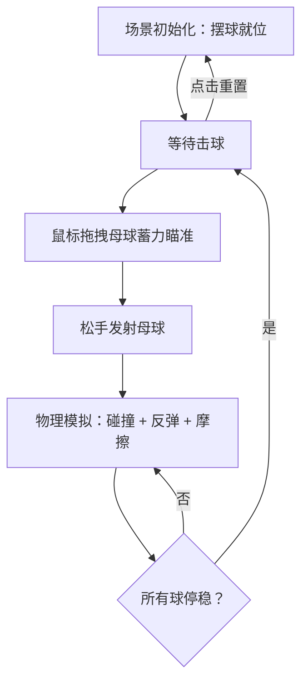

## 1. 产品概述

3D桌球模拟器 —— 一个沉浸式的3D台球物理体验应用。用户在精致的3D台球桌上，通过鼠标拖拽母球蓄力瞄准，松手后母球冲出击散彩球堆，观赏真实的碰撞与滚动物理效果。没有复杂规则，纯粹的击球乐趣。

- 目标用户：休闲游戏爱好者、物理模拟爱好者
- 核心价值：逼真的3D视觉效果 + 流畅的物理碰撞体验

## 2. 核心功能

### 2.1 功能模块

1. **主页面**：3D台球场景、击球交互、重置控制

### 2.2 页面详情

| 页面名称 | 模块名称 | 功能描述 |
|---------|---------|---------|
| 主页面 | 3D台球场景 | 渲染3D台面、库边、15颗彩球三角形排列、白色母球 |
| 主页面 | 击球交互 | 鼠标拖拽母球向后拉蓄力，显示瞄准方向线，松手发射 |
| 主页面 | 物理模拟 | 球与球碰撞、库边反弹、摩擦减速、自然停球 |
| 主页面 | 重置控制 | 一键重新摆球，重置所有球位置 |

## 3. 核心流程

用户进入页面后看到3D台球桌，母球和彩球已就位。用户在母球上按住鼠标向后拖拽设定力度和方向，松手后母球沿瞄准方向冲出撞击彩球。彩球四处碰撞滚动，碰到库边弹回，受摩擦力逐渐停稳。球全部停稳后，用户可再次击球或点击重置按钮重新摆球。

## 4. 用户界面设计

### 4.1 设计风格

- 主色调：深木色台框 + 翡翠绿台面 + 暖金点缀
- 按钮风格：圆角半透明玻璃质感
- 字体：Playfair Display（标题）+ 系统无衬线字体
- 布局：全屏3D场景，右上角浮动控制按钮
- 光影：顶部暖光照射台面，球体真实高光反射

### 4.2 页面设计概览

| 页面名称 | 模块名称 | UI元素 |
|---------|---------|--------|
| 主页面 | 3D台球场景 | 深木色边框、翡翠绿台面、16颗球（1白+15彩）、顶部聚光灯 |
| 主页面 | 击球交互 | 拖拽时显示力度指示弧线、瞄准方向虚线 |
| 主页面 | 重置控制 | 右上角浮动按钮，半透明玻璃质感，重新摆球图标 |

### 4.3 响应式设计

- 桌面优先设计，全屏3D画布自适应窗口大小
- 移动端支持触控拖拽操作

### 4.4 3D场景指引

- 环境：暗色室内环境，台面上方暖色聚光灯
- 光照：主光源（DirectionalLight）从顶部照射 + 环境光补充 + 台面点光源
- 相机：透视相机，45度俯视角，略微倾斜，固定视角
- 构图：台球桌居中，相机距离适中，能看到全桌面
- 交互：鼠标拖拽母球蓄力，蓄力时显示力度和方向指示
- 后期处理：轻微辉光效果（Bloom），球体高光反射
- 资源来源：程序化生成所有3D几何体和材质，无外部模型依赖
