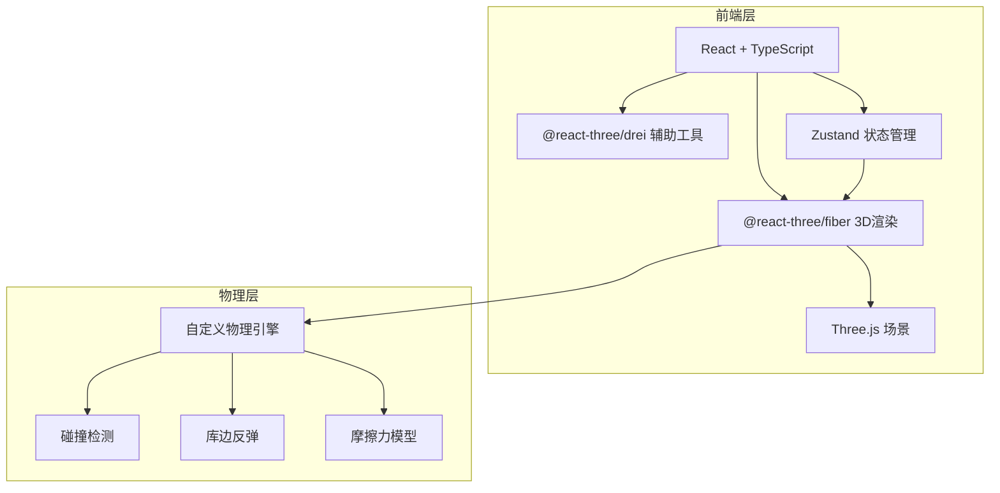

## 1. 架构设计



## 2. 技术说明

- 前端：React@18 + TypeScript + Vite + Tailwind CSS
- 初始化工具：vite-init (react-ts 模板)
- 3D渲染：three + @react-three/fiber + @react-three/drei + @react-three/postprocessing
- 状态管理：Zustand
- 物理引擎：自定义实现（2D平面物理，球-球碰撞 + 球-墙碰撞 + 摩擦力）
- 后端：无
- 数据库：无

## 3. 路由定义

| 路由 | 用途 |
|-----|------|
| / | 主页面，3D台球场景与交互 |

## 4. 核心技术设计

### 4.1 物理引擎设计

台球在2D平面运动（Y轴固定），物理模拟包含：

- **球-球碰撞**：圆-圆碰撞检测，弹性碰撞响应，恢复系数0.95
- **库边反弹**：球心到库边距离 < 半径时反弹，法向速度反转并乘以恢复系数
- **摩擦力**：每帧速度乘以摩擦系数（0.985），速度低于阈值归零
- **运动更新**：每帧按速度更新位置，使用 requestAnimationFrame 驱动

### 4.2 球体数据结构

```typescript
interface Ball {
  id: number
  position: [number, number, number]  // x, y, z
  velocity: [number, number]          // vx, vz (2D运动)
  color: string
  number: number
  isCue: boolean                      // 是否母球
}
```

### 4.3 交互设计

- **蓄力**：鼠标在母球上按下 → 拖拽远离母球 → 距离映射力度
- **瞄准**：拖拽反方向为击球方向，显示瞄准辅助线
- **发射**：松手时根据力度和方向设置母球速度
- **状态机**：IDLE → AIMING → SHOOTING → ROLLING → IDLE

### 4.4 台面尺寸

- 台面内部：2.54m × 1.27m（标准9尺台球桌比例）
- 球半径：0.028m（标准台球尺寸比例）
- 3D单位：1单位 = 1m

## 5. 组件结构

```
src/
├── components/
│   ├── PoolTable.tsx        # 台球桌主体（台面+库边+桌腿）
│   ├── Ball.tsx             # 单个球体组件
│   ├── Balls.tsx            # 所有球的渲染管理
│   ├── CueStick.tsx         # 球杆视觉辅助
│   ├── AimingLine.tsx       # 瞄准辅助线
│   ├── PowerIndicator.tsx   # 力度指示器
│   └── UI.tsx               # 浮动UI控制按钮
├── hooks/
│   └── usePhysics.ts        # 物理模拟Hook
├── store/
│   └── useGameStore.ts      # Zustand游戏状态
├── utils/
│   └── physics.ts           # 物理计算工具函数
├── pages/
│   └── Home.tsx             # 主页面
├── App.tsx
└── main.tsx
```
